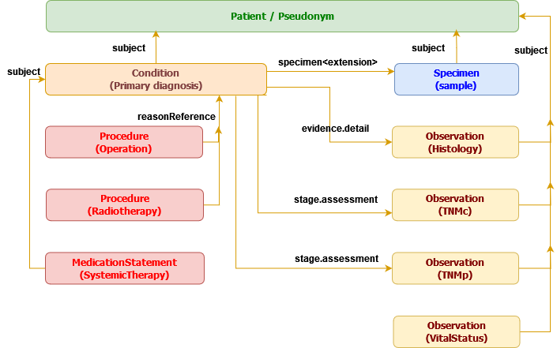

# CCE FHIR® Implementation Guide

The Implementation Guide for CCE FHIR profiles.

This repository has been scaffolded using the [sushi](https://fshschool.org/docs/sushi/tutorial/) tool and it contains CCE FHIR profiles in the **FSH** or [FHIR Shorthand](https://build.fhir.org/ig/HL7/fhir-shorthand/) notation.



## Usage

When you run `sushi init` and enter required values, you get a project which looks like the current project. You get `input/fsh` folder in which you are supposed to create `*.fsh` files describing your **CodeSystems, ValueSets & Profiles**.

### Building

After you've added the various `*.fsh` files, you can build the project using:

```sh
sushi build .
```
Or,

```sh
sushi
```

Running SUSHI will create a `cce-fhir-ig/fsh-generated` directory, and populate it with the files needed to create the IG using the HL7 FHIR IG Publisher tool.

### Generate the IG

Run:

```sh
# old cmd: ./_updatePublisher.sh
./_build.sh update
```

This will download the latest version of the HL7 FHIR IG Publisher tool into **./input-cache**. *This step can be skipped if you already have run the command recently, and have the latest version of the IG Publisher tool*.

Now run:

```sh
# old cmd: ./_genonce.sh
./_build.sh build
```

This will run the HL7 FHIR IG generator, which may take several minutes to complete. After the publisher is finished, open the file `/cce-fhir-ig/output/index.html` to see the resulting IG.

### Validating instances (of resources) against the IG

#### Manual

Download the latest version of the [validator](https://github.com/hapifhir/org.hl7.fhir.core/releases/latest/download/validator_cli.jar) tool.

Place it under the `input-cache` dir, and rename it as `validator.jar`.

Now, you can validate any instance of a resource (in JSON, XML or turtle format) against this IG, using:

```sh
java -jar input-cache/validator.jar output/Patient-Patient-id-115.json -ig output/package.tgz
java -jar input-cache/validator.jar output/Condition-Condition-id-115.json -ig output/package.tgz
java -jar input-cache/validator.jar output/Procedure-Operation-id-115.json -ig output/package.tgz
```

#### Validation scripts (bundled in the releases)

Each [release](##releases) attaches a ready-to-use validation bundle (`cce-fhir-ig-bundle-vX.Y.Z.zip`) containing `validator.jar`, the IG's `package.tgz`, and two helper scripts, so users can validate their own data against this IG without building anything:

1. Download the bundle from the [Releases](https://github.com/samply/cce-fhir-ig/releases) page.
2. Extract the zip to a folder of your choice (all files must stay together).
3. Validate an instance of your choice:

   macOS / Linux:

   ```sh
   ./validate.sh instance.json
   ```

   Windows (cmd):

   ```cmd
   validate.bat instance.json
   ```

Multiple files and additional validator options are supported, e.g.:

```sh
./validate.sh -profile https://www.cancercoreeurope.eu/fhir/StructureDefinition/PatientPseudonym patient.xml
```

Both scripts run the same validation command internally:

```sh
java -jar validator.jar -ig package.tgz -tx n/a -version 4.0.1 <instance-file>
```

The first run downloads the IG's dependency packages (`de.basisprofil.r4`, `de.bbmri.fhir`) from the FHIR package registry, so an internet connection is
required once; results are cached locally afterwards. See `tools/README.md` for details.

## Release versioning

This repository is a continuation of the previous work from the [cce-fhir](https://github.com/samply/cce-fhir) repository. The FHIR profiles in the old repository were in XML, whereas this repository has the profiles in FSH notation (*an additional advantage being that we get data validation for free, using the FHIR validator tool*). The last release of CCE FHIR profiles on the [Simplifier](https://simplifier.net/cce) website, was made from the `feature/minimal` branch of the old repository and was versioned as `0.5.0`. **Hence the first version being released from this repository is** `v0.6.0`.

Please check the old [README.md](https://github.com/samply/cce-fhir/blob/feature/minimal/README.md) file for more details.

### Creating a tagged release

**Always create tagged releases from the `main` branch** and **after** the version bump in `sushi-config.yaml` has been merged to `main`. This keeps the released bundle (GitHub Release + Simplifier) consistent with what GitHub Pages deploys. The recommended flow is:

1. Create a branch, e.g. `release/0.6.0`, and bump the `version` in `sushi-config.yaml` (this is the version shown on the GitHub Pages site).
2. Open a pull request into `main`, have it reviewed, and merge it. GitHub Pages is only deployed on `main` pushes, so this is what publishes the new version.
3. `git checkout main && git pull` so your local checkout has the merged bump.
4. Tag the *merged* commit and push it (which triggers the workflow to create a release archive and upload to Simplifier):

```
git tag -a v0.6.0 -m "Release 0.6.0" && git push origin v0.6.0
```

### Releases

| Version | Artifact | Branch | Date | Comments |
|---------|----------|--------|------|----------|
| v0.6.0 | cce-fhir-ig-bundle-v0.6.0.zip | `main` | 18-Sep-2026 | Initial release from this repository |
| v0.6.1 | cce-fhir-ig-bundle-v0.6.1.zip | `release/0.6.1` | 18-Sep-2026 |  |

## Publishing to Simplifier

On every git tag push (`v*`), the [publish workflow](.github/workflows/publish.yml) builds the IG, attaches the validation bundle (`validator.jar` + `package.tgz` + `validate.sh`/`validate.bat` + `README.md`) to a GitHub Release, and syncs the built FHIR resources to [Simplifier](https://simplifier.net/cce).

The Simplifier upload needs the following values configured in the repository settings (**Settings → Secrets and variables → Actions**):

| Type | Name | Value | Purpose |
|------|------|-------|---------|
| Repository variable | `SIMPLIFIER_PROJECT` | `cce` | Project id in the Simplifier URL (`https://simplifier.net/cce`) |
| Repository secret | `SIMPLIFIER_USER` | `<user>` | Simplifier account user |
| Repository secret | `SIMPLIFIER_PASS` | `<password>` | Simplifier account password |

1. Go to your repository on GitHub → **Settings** → **Secrets and variables** → **Actions**.
2. On the **Variables** tab, add `SIMPLIFIER_PROJECT` with value `cce`.
3. On the **Secrets** tab, add `SIMPLIFIER_USER` and `SIMPLIFIER_PASS`.

The Simplifier step uses the current JWT-based API: it retrieves a token from `https://api.simplifier.net/token`, zips the `output/*.json` resources, and `PUT`s them to the project ZIP API (`https://api.simplifier.net/<project>/zip`).

The step runs only on tagged releases and is skipped automatically if any of these values is missing, so the rest of the pipeline (GitHub Release creation) is never blocked by an unconfigured Simplifier sync.

### What gets uploaded, where, and how

**What:** after a tagged build, the workflow zips all `output/*.json` FHIR resources (the profiles, extensions, code systems, value sets, instances, and the ImplementationGuide itself) into `simplifier-project.zip`.

**Where:** the zip is `PUT` to the project ZIP API (`https://api.simplifier.net/<project>/zip`). The resources land in your Simplifier project, where they are visible under the **Resources** tab. To confirm the sync happened, check your project's **Log** tab or open **Manage → Import log**.

**Publishing the package (manual UI step):** the API only syncs resources; it cannot create a package release. To publish the synced resources as a FHIR package:

1. Log in to Simplifier and open your project (https://simplifier.net/cce).
2. Go to the **Releases** tab.
3. Click **Create → Create new package** (or **Create new version for...** for a subsequent release).
4. Enter a name (must contain at least one dot, e.g. `cce.fhir.ig`), the version number (e.g. `0.6.1`), a description, and release notes.
5. Choose whether it is a pre-release and whether it should be public or private.
6. Click **Create** to publish the package.

The published version then appears under the **Releases** tab and becomes installable via the FHIR package server.

## GitHub Pages

The IG is published to GitHub Pages: **https://samply.github.io/cce-fhir-ig/**

Every push to `main` rebuilds the IG and deploys `output/` to the `gh-pages` branch (see [publish workflow](.github/workflows/publish.yml)).

For this to work, GitHub Pages must be enabled in the repository settings: **Settings → Pages** → **Build and deployment** → Source: **Deploy from a
branch** → Branch: **`gh-pages`** (**/ root**).
